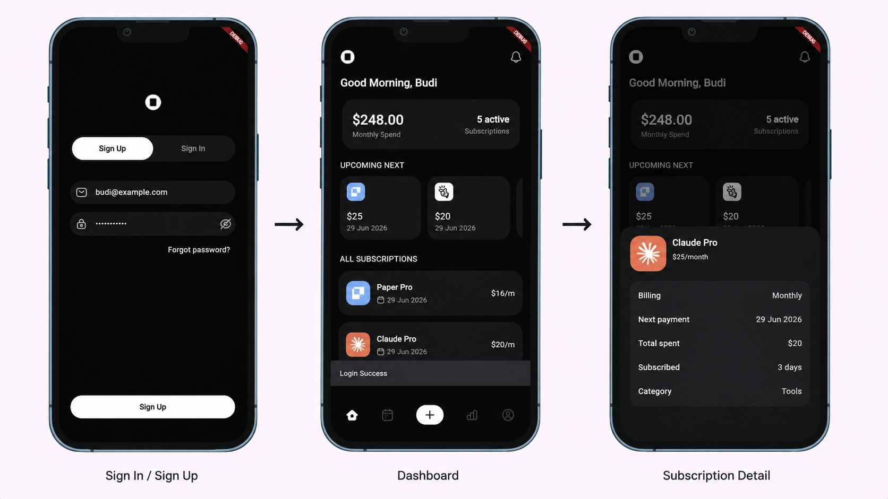

# Stack Mobile Apps
Stack is a smart subscription tracker app that helps users manage recurring payments, monitor upcoming renewals, and gain better control over their monthly spending.

## Features
- User Authentication (Login)
- Dashboard Subscription
- Local Notification
- REST API Integration
- State Management
- Local Storage

## Design
Here's the design file:
[STACK MOBILE APP](https://www.figma.com/design/7XfHMII64S9KW9SAl3bxPj/STACK---MOBILE-APP?node-id=0-1&t=BzF28gV6Nf9JSzcT-1)

## Installation
Clone this repository:
```bash
git clone https://github.com/maqidz-ops/stack_app.git
cd stack_app
```

Install dependecies:
```bash
flutter pub get
```

Run the application:
```bash
flutter run
```

## Tech Stack
- Flutter
- Dart
- Provider
- MockAPI
- Shared Preferences
- Flutter Local Notifications
- Local Storage

## Screenshots


## Getting Started

This project is a starting point for a Flutter application.

A few resources to get you started if this is your first Flutter project:

- [Learn Flutter](https://docs.flutter.dev/get-started/learn-flutter)
- [Write your first Flutter app](https://docs.flutter.dev/get-started/codelab)
- [Flutter learning resources](https://docs.flutter.dev/reference/learning-resources)

For help getting started with Flutter development, view the
[online documentation](https://docs.flutter.dev/), which offers tutorials,
samples, guidance on mobile development, and a full API reference.
